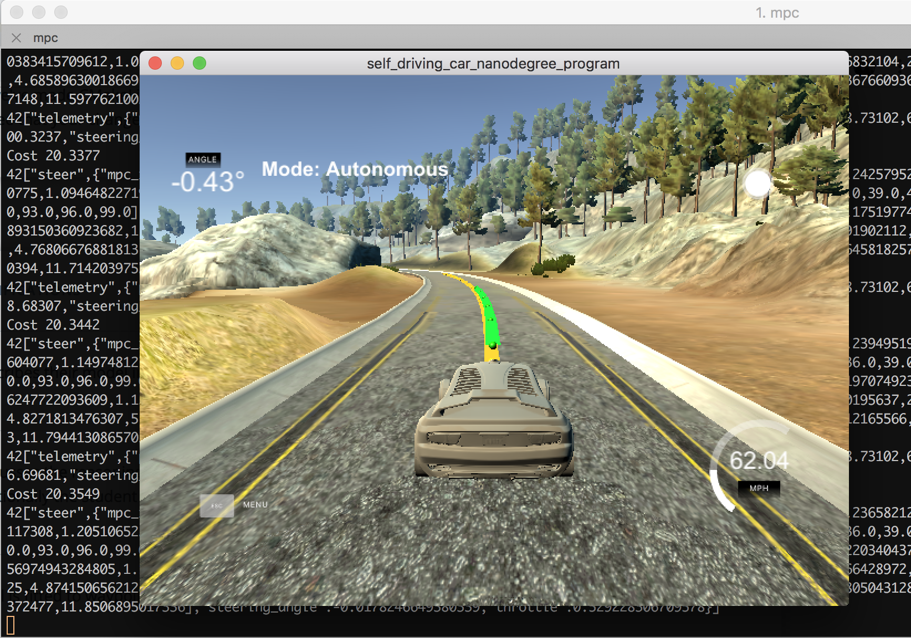
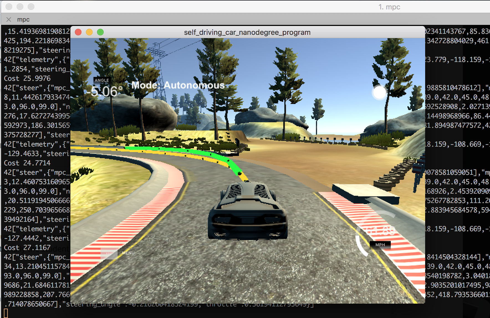

# Term2 - Project 5 : CarND-Controls-MPC 

Self-Driving Car Engineer Nanodegree Program

Project 5 - MPC Control Project

# Project Rubric

## Compilation

After cloning this repo.

```
1. mkdir build
2. cd build
3. cmake ..
4. make
5. ./mpc
```

## Implementation

Reference speed = 62 MPH ( approx. 100Km/h )

To achieve this speed, N and dt was set 6 and 0.1 respectively.

( The parameter values were found empirically, if N is too high too
much errors can be introduced, likewise if N is too small considering
aimed speed, it is incomplete thus it can introduce high error
rate. Thus outputs wrong steering angle and throttle. )


--------

Given the state

```c
	  // Get state = [ x, y, psi, v]
          double px = j[1]["x"];
          double py = j[1]["y"];
          double psi = j[1]["psi"];
          double v = j[1]["speed"];
```

the control

```c
	  // Get control inputs = [ delta, a]
	  double delta = j[1]["steering_angle"];
	  double a = j[1]["throttle"];
```

and the latency of 100ms = 0.1s

```c
	  // compute new px py psi v
	  const double latency = 0.1;
	  // Use the same Lf defined in MPC.cpp
	  const double Lf = 2.67;
```

and reference trajectory (waypoints)

```c
	  // Get waypoints
          vector<double> ptsx = j[1]["ptsx"];
          vector<double> ptsy = j[1]["ptsy"];
```

-----------

Polynomial Fitting

In the main.cpp given the ptsx trajectory and the car position in the
map cordinate, computed relative cordinate location ( in terms of
car, setting current car position as origin ( 0.0 , 0.0 )

```c
          vector<double> ptsx = j[1]["ptsx"];
          vector<double> ptsy = j[1]["ptsy"];
		  
          // Transforming waypoint coordinates to coordinates in the vehicle's coordinate system
          Eigen::VectorXd ptsx_car(ptsx.size());
          Eigen::VectorXd ptsy_car(ptsy.size());
          for(int i = 0;  i < ptsx.size();  i++ ) {
	    // Consider car is in origin of car cordinate
            // relative distance between map waypoint and car position
            double carcord_x = ptsx[i] - px;
	    double carcord_y = ptsy[i] - py;

            // Homogeneous transformation from the car's point of view (=base is (0,0))
            ptsx_car[i] = 0.0 + cos(-psi) * carcord_x - sin(-psi) * carcord_y;
	    ptsy_car[i] = 0.0 + sin(-psi) * carcord_x + cos(-psi) * carcord_y;
          }
```

Then applied 3rd order polynomial fitting

```c
Eigen::VectorXd pts_car_coeffs = polyfit(ptsx_car,ptsy_car,3);
```

then computed cte / epsi

```c
	  // Now we consider position in car coordinate
	  double car_x = 0;
	  double car_y = 0;
	  // Note if delta is positive we rotate counter-clockwise, or turn left.
	  // In the simulator however, a positive value implies a right turn and
	  // a negative value implies a left turn. Thus multiply -1 to correct it in simulation
	  double car_psi = -1*delta;
	  double cte = polyeval(pts_car_coeffs, car_x) - car_y;
	  // Due to the sign starting at 0, the orientation error is -f'(x).
	  // derivative of coeffs[0] + coeffs[1] * x -> coeffs[1]
	  double epsi = car_psi - atan(pts_car_coeffs[1]);
```

Upon above information, computed current location considering the latency

```c
	  // compensate current location considering latency
	  double px_latency = v * cos(car_psi) * latency;
	  double py_latency = v * sin(car_psi) * latency;
	  double psi_latency = v * car_psi * latency/Lf;
	  double v_latency = v + a * latency;

      //cte t+1 = cte t + vt*sin(epi)*dt, where dt = latency
      double cte_latency = cte + v*sin(epsi)*latency;
	  // Lesson 18 : Vehicle Models : 10. Errors
      double epsi_latency = epsi - v/Lf* delta * latency;
```

These values were used as state

```c
	  Eigen::VectorXd state(6);
	  //state << px, py, psi, v, cte, epsi;
	  //state << car_x, car_y, car_psi, v, cte, epsi;
	  state << px_latency, py_latency, psi_latency, v_latency, cte_latency, epsi_latency;
```

Then using MPC solver computed optimal (predicted) the steering angle and throttle

```c
          /*
          * TODO: Calculate steering angle and throttle using MPC.
          *
          * Both are in between [-1, 1].
          *
          */
	  auto vars = mpc.Solve(state, pts_car_coeffs);

	  // Constraints delta in [-25deg , 25deg] and a in [-1, 1]
          double steer_value = vars[0] / deg2rad(25);
          double throttle_value = vars[1];
```

-------

MPC solver

Referenced CarND-MPC-Quizzes 
https://github.com/udacity/CarND-MPC-Quizzes/blob/master/mpc_to_line/solution/MPC.cpp
But changed the linear model in the quizz to our 3rd polynomial model 

```c
      // In the quizz .. we've considered linear model..
      // AD<double> f0 = coeffs[0] + coeffs[1] * x0;
      // AD<double> psides0 = CppAD::atan(coeffs[1]);
      // In our case we should consider 3rd polynormial
      AD<double> f0 = coeffs[0] + coeffs[1] * x0 + coeffs[2] * CppAD::pow(x0, 2) + coeffs[3] * CppAD::pow(x0, 3);
      AD<double> psides0 = CppAD::atan(coeffs[1] + 2.0 * coeffs[2] * x0 + 3.0 * coeffs[3] * CppAD::pow(x0, 2));
```

Then the model was computed as shown below

```c
      // Here's `x` to get you started.
      // The idea here is to constraint this value to be 0.
      //
      // Recall the equations for the model:
      // x_[t] = x[t-1] + v[t-1] * cos(psi[t-1]) * dt
      // y_[t] = y[t-1] + v[t-1] * sin(psi[t-1]) * dt
      // psi_[t] = psi[t-1] + v[t-1] / Lf * delta[t-1] * dt
      // v_[t] = v[t-1] + a[t-1] * dt
      // cte[t] = f(x[t-1]) - y[t-1] + v[t-1] * sin(epsi[t-1]) * dt
      // epsi[t] = psi[t] - psides[t-1] + v[t-1] * delta[t-1] / Lf * dt
      fg[1 + x_start + t] = x1 - (x0 + v0 * CppAD::cos(psi0) * dt);
      fg[1 + y_start + t] = y1 - (y0 + v0 * CppAD::sin(psi0) * dt);
      // fg[1 + psi_start + t] = psi1 - (psi0 + v0 * delta0 / Lf * dt);
      // Note!!: if delta is positive we rotate counter-clockwise,
      // or turn left. In the simulator however, a positive value implies
      // a right turn and a negative value implies a left turn.
      // Change the update equation as follows : see the minus sign
      fg[1 + psi_start + t] = psi1 - (psi0 - v0 * delta0 / Lf * dt);
      fg[1 + v_start + t] = v1 - (v0 + a0 * dt);
      fg[1 + cte_start + t] = cte1 - ((f0 - y0) + (v0 * CppAD::sin(epsi0) * dt));
      fg[1 + epsi_start + t] = epsi1 - ((psi0 - psides0) + v0 * delta0 / Lf * dt);
```


### Simulation result

It achieved autonomous driving at speed of 62 MPH ( approx. 100Km/h )

To achieve smooth driving, sequential steering and throttle tuning is 
applied ( by referencing Lesson 19: 10. Tuning MPC ) 


in MPC.cpp

```c
    // Minimize the value gap between sequential actuations.
    for (int t = 0; t < N - 2; t++) {
      // Tuning sequencial steering to make it smooth
      // referencing Lesson 19: 10 Tuning MPC
      // and also to make throatling smooth
      fg[0] += 180 * CppAD::pow(vars[delta_start + t + 1] - vars[delta_start + t], 2);
      fg[0] +=  60 * CppAD::pow(vars[a_start + t + 1] - vars[a_start + t], 2);
    }
```






